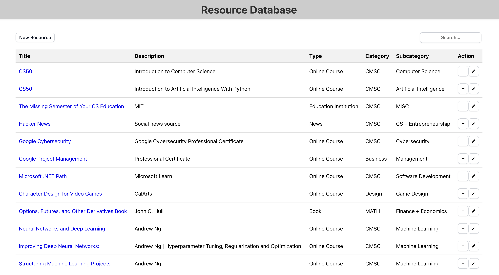

## Demo

## About The Project

The idea behind this project was to build something that practices full-stack web development, basic CRUD functionality, REST API development, web application architecture design, and remedies a problem of mine. I often find myself overwhelmed with the amount of learning resources out there and find myself saving information about these resources in places that were most convenient at the time. That could be a notebook I never use again, my phone notes, on a google drive, or some random scrap piece of paper. Building this project not only helped me practice software development but also helped me find a home for my learning as a life-long student.

### Built With

* React.js
* Node.js
* Express.js
* MySQL
